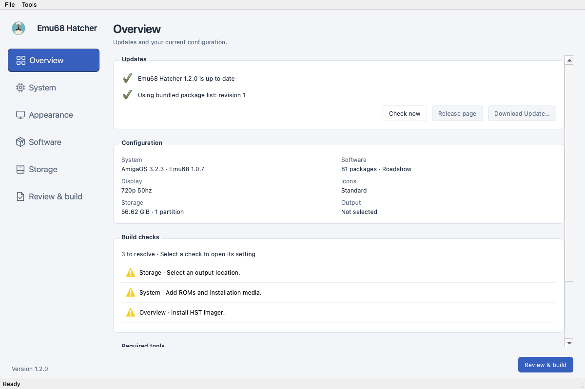

#  Emu68 Hatcher

Build ready-to-run SD cards with pre-configured Workbench installation (+batteries included) for [PiStorm](https://github.com/captain-amygdala/pistorm)-accelerated Amigas. 

Runs on macOS, Linux and Windows.

<a href="docs/assets/screenshots/overview.png"></a>

**Features**

- Bootable Emu68 install for pistorm32-lite, pistorm, pistorm16
- Workbench install from stock ADFs (3.1 / 3.2 / 3.2.2.1 / 3.2.3), or AmigaOS 3.9 from the original CD image
- Customizable [package set](https://rootrootde.github.io/emu68hatcher/packages/): MUI, WHDLoad+WHDLoadWrapper, IBrowse, HippoPlayer, ViNCEd, ...
- RTG (Picasso96), networking (Roadshow, MiamiDX, or AmiTCP_NG + wifipi/genet drivers), partition layout editor (PFS3 + FFS) - user-supplied full versions of Roadshow and Picasso96 supported
- SD card flashing (direct, or write the **.img** to a card after the build), sparse **.img** by default
- Build configs as JSON (save / load)
- Update checks for the app and its signed package list

→ see [docs](https://rootrootde.github.io/emu68hatcher/) for more

## Quickstart

### 1. Download

From [releases](https://github.com/rootrootde/emu68-hatcher/releases):

- **macOS:** emu68hatcher-VERSION-macos-arm64.dmg (or -macos-x64.dmg on Intel)
- **Linux** (Debian / Ubuntu): emu68hatcher-VERSION-linux-x64.deb (or -arm64.deb)
- **Windows:** emu68hatcher-VERSION-windows-x64.exe (or -arm64.exe)

### 2. Install

- **macOS:** drag Emu68 Hatcher.app into /Applications
- **Linux:** sudo apt install ./emu68hatcher-\*-linux-\*.deb
- **Windows:** run the .exe installer

### 3. Launch

- **macOS:** open Emu68 Hatcher from /Applications. First run: grant Full Disk Access to **hst-imager** so SD card writes work - see the [installation guide](https://rootrootde.github.io/emu68hatcher/installation/#macos).
- **Linux:** emu68hatcher
- **Windows:** from the Start menu

## From source (any OS, Python 3.10+)

```bash
git clone https://github.com/rootrootde/emu68-hatcher.git
cd emu68-hatcher
python3 bootstrap.py            # windows: python bootstrap.py
emu68hatcher                    # windows: python -m emu68hatcher
```

For usage see → [docs](https://rootrootde.github.io/emu68hatcher/).

### Picasso96 settings

**src/main/python/emu68hatcher/data/reference/picasso96.json** defines the
57 bundled resolutions, their display IDs and per-depth timings. The configure
stage generates **DEVS:Picasso96Settings** from it. Workbench mode IDs come from
the same data; reordering resolution blocks does not renumber them.

The default output is byte-identical to the previous bundled file, including
disabled depths and the original annotation and name bytes. BoardType remains
14, paired with **VC4_LEGACY_ID** on VideoCore. UAE uses the same settings file.
Switching to PiStorm BoardType 39 would also require separate UAE settings and
changes to monitor tooltypes; it is not selected by Emu68 version.

The format reference was [Emu68P96Settings](https://github.com/flype44/Emu68P96Settings)
and the VideoCore [P96 headers](https://github.com/michalsc/VideoCore.card/blob/main/src/settings.h).
The reader and writer here are implemented locally; no upstream scripts are bundled.

With the development environment activated, inspect an existing file or
regenerate the bundled copy:

```bash
python -m emu68hatcher.data.picasso96 inspect \
  src/main/python/emu68hatcher/data/local_packages/System/Devs/Picasso96Settings \
  /tmp/picasso96-inspected.json
python -m emu68hatcher.data.picasso96 generate \
  src/main/python/emu68hatcher/data/reference/picasso96.json \
  src/main/python/emu68hatcher/data/local_packages/System/Devs/Picasso96Settings
```

Keep the bundled copy in sync when editing the JSON: cached package catalogues
still install it before configuration. The JSON stores ordered IFF chunks;
**defaults** supplies shared fields, and each chunk can override them.
Inspection preserves unknown chunks as hex and retains padding bytes.
New resolutions or timing changes need PiStorm hardware verification.

## Credits

Thanks to:

- [mja65](https://github.com/mja65)'s fantastic work on the [Emu68 Imager](https://github.com/mja65/Emu68-Imager-Software) project
- [Emu68](https://github.com/michalsc/Emu68) and [Emu68-tools](https://github.com/michalsc/Emu68-tools) by Michal Schulz (MPL-2.0) - m68k emulation and the on-Amiga companion tools (EmuControl, VideoCore.card, WiFiPi.device, ...)
- [hst-imager](https://github.com/henrikstengaard/hst-imager) and [hst-amiga](https://github.com/henrikstengaard/hst-amiga) by Henrik Stengaard (MIT) - disk image + RDB tooling
- [Emu68P96Settings](https://github.com/flype44/Emu68P96Settings) by flype44 - format reference for reading and generating Picasso96 settings

Bundled / downloaded at build time:

- [WHDLoad](http://whdload.de/)
- [Roadshow Demo](https://www.amigashop.org/product_info.php?cPath=2_34&products_id=200&language=de) bundled with permission from A. Magerl (APC&TCP)
- [MiamiDX 1.0c](https://aminet.net/package/comm/tcp/MiamiDx10cmain) downloaded from Aminet when selected
- [7-Zip](https://github.com/ip7z/7zip) (GNU LGPL) - downloaded at install time, License.txt copied alongside the binary
- [Poseidon USB stack](https://wiki.icomp.de/wiki/RapidRoad) by Chris Hodges - downloaded from the iComp wiki at build time when USB support is selected
- Aminet packages (MUI, HippoPlayer, IBrowse, akDatatypes, Picasso96, ...) - downloaded from [aminet.net](https://aminet.net) at build time; each ships its own readme with license

## License

[LICENSE](./LICENSE)

Documentation is published by the **Deploy documentation** workflow in
[rootrootde.github.io](https://github.com/rootrootde/rootrootde.github.io/actions/workflows/pages.yml).
It builds the main branch of **emu68-hatcher** and keeps the existing **/emu68hatcher/** URLs.
