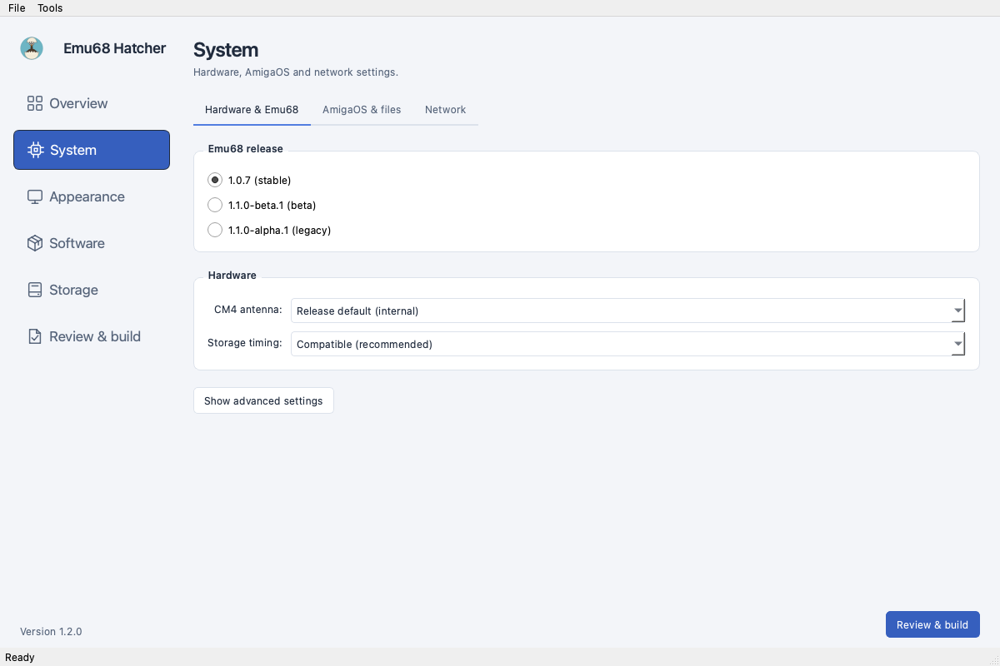
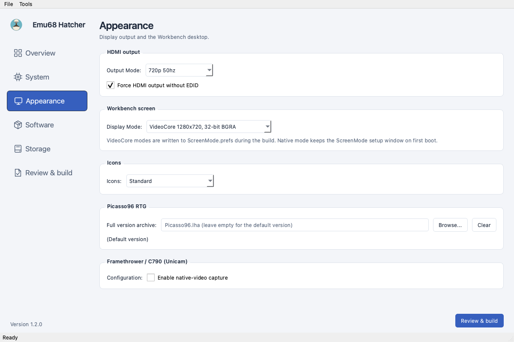
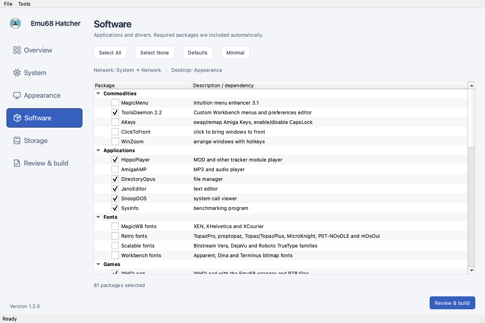
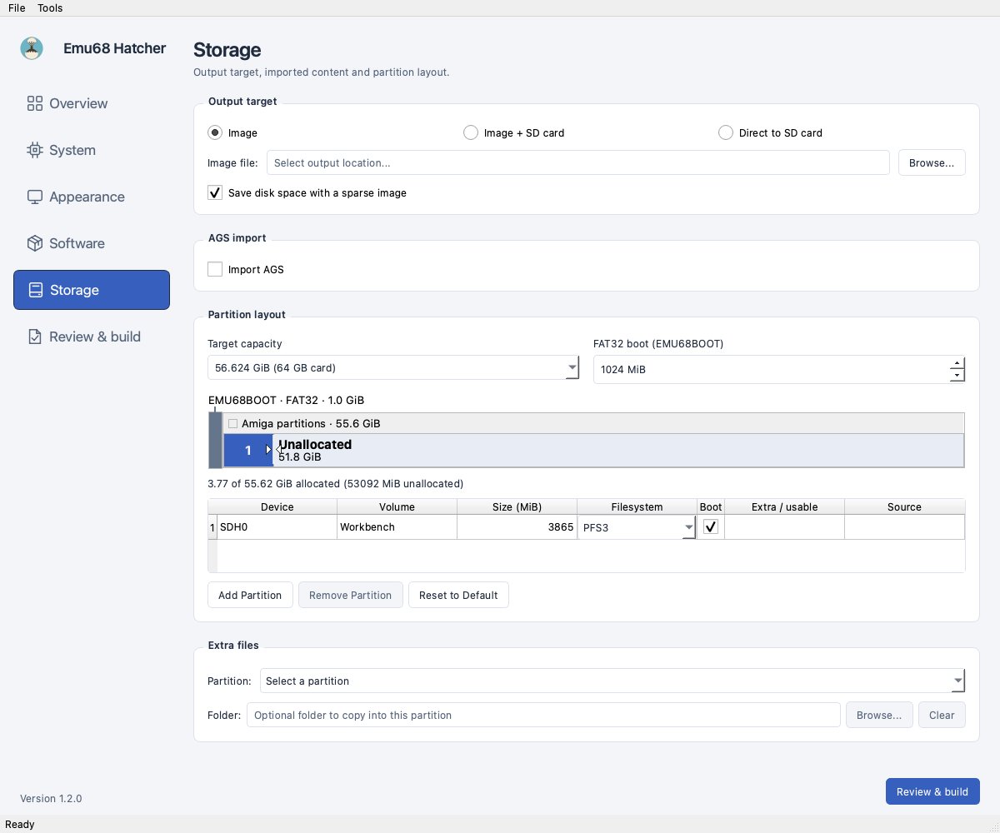
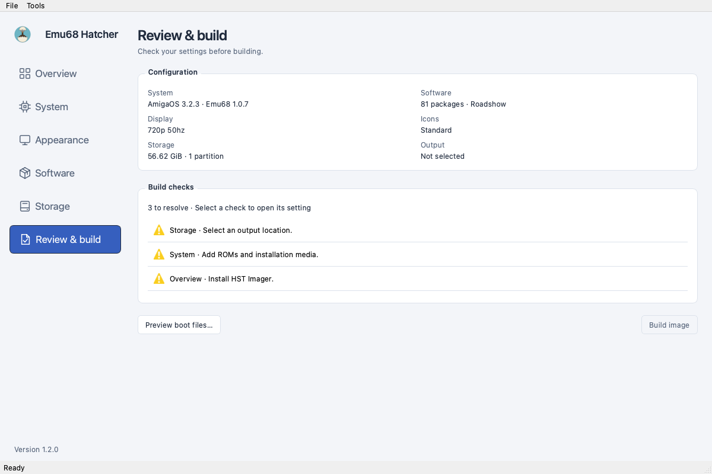

# Usage

## Choose a work area

The sidebar has six areas. Visit them in any order; incomplete settings do not
prevent navigation. **Load Configuration…** and **Save Configuration…** are in
the File menu. Settings are not saved automatically, and WiFi credentials are
not written to configuration files.

### Overview

**Updates** is visible at the top when the app opens. The configuration summary
and compact build checks follow below. Click a check or activate it with the
keyboard to open its setting. **Required tools** contains tool downloads; the
**Tools** menu jumps there directly. Application downloads go to Downloads;
opening a Linux installer requires a Debian-based system.

[](assets/screenshots/overview.png){ target="_blank" }

### System

- **Hardware & Emu68:** select the release and hardware settings. Boot, storage,
  CPU, compatibility and manual overrides are under **Show advanced settings**.
- **AmigaOS & files:** choose the Workbench version, add directories containing
  ROMs and installation media, and select languages. Files are matched by hash;
  **Show details…** lists the detected files. AmigaOS 3.9 uses the CD **.iso**
  and a Kickstart 3.1 ROM. Do not mount the ISO.
- **Network:** choose Roadshow, MiamiDX, AmiTCP_NG or None. Roadshow archives and
  MiamiDX registration-key folders belong here. DHCP/static addresses, routing,
  DNS and WiFi settings remain available where the selected stack supports them.

[](assets/screenshots/system.png){ target="_blank" }

### Appearance

HDMI output, Workbench screen mode, icons, Picasso96 and native-video capture
share one page, without subpages. **Force HDMI output without EDID** is directly
below the output mode. Selecting native-video capture reveals its device and
scaling controls. C790 requires Emu68 1.1 or later and a VideoCore Workbench mode.
Use **Browse…** to supply your full **Picasso96.lha**.

Available icons follow the selected OS version and detected media. GlowIcons
requires its matching ADF. Theme support remains disabled in this checkout;
there is no separate, mostly empty theme page.

[](assets/screenshots/appearance.png){ target="_blank" }

### Software

Select applications, bundles and hardware drivers. The list is filtered for the
chosen Workbench and Emu68 versions. The expandable **Required packages** group
shows automatic selections and their reasons. Network and theme choices are
edited in System and Appearance, not duplicated here. MUI remains selectable
when an application requires it. See [Packages](packages.md) for the catalog.

**Minimal** clears optional software, networking and theme selection. The OS,
RTG, filesystem and FirstBoot helpers remain, including fat95. AGS, extra files,
ROMs, display mode, partitions, icons and installation media are unchanged.
Extra files are still copied and can add software to a minimal image.

**Select None** clears software requests only; network and theme dependencies
can still be required. **Defaults** restores software defaults without changing
those owners. Saved requests remain separate from automatic dependencies.

Ethernet, WiFi, USB, NVMe, I2C clock support and diagnostic tools can be selected
separately. A network stack requires both Ethernet and WiFi support. USB and
NVMe are offered only for compatible Emu68 versions.

The **Utilities** group has three native Amiga tools. They are development builds
and have not been tested on real hardware yet:

- **Hatcher Prefs:** network settings, connect/disconnect and Emu68 boot settings.
  Installed as **C:Hatcher-Prefs** with a copy in **SYS:Emu68-Hatcher/Tools/**.
  Every network stack pulls it in, because **SYS:Utilities/Network Config** and
  the Network menu now open it. Needs MUI for its window.
- **Hatcher Packages:** browse and install signed packages on the Amiga. Needs
  MUI, AmiSSL and XADMaster.
- **Emu68 Manager:** download, switch and restore Emu68 releases on the card.
  Needs MUI, AmiSSL (also offline: release plans are signature-checked) and
  XADMaster. **Transaction-Recovery** in its drawer works without any of them.

Hatcher Packages and Emu68 Manager are installed to **SYS:Emu68-Hatcher/Tools/**
with their manuals.

Each image also gets two records the Amiga tools can read.
**SYS:Emu68-Hatcher/Packages/build-receipts.json** lists, per package, the files the
build wrote with their sizes and SHA-256, startup blocks and menu entries, and marks
files your extra content replaced as locally modified. Packages that installed no
files get no receipt. **SYS:Emu68-Hatcher/Installation.json** records the Kickstart and
Emu68 versions, the network stack and hashes of the generated config.txt and
cmdline.txt. Both describe the image as built; they are not signed, and Hatcher
Packages lists the packages as untracked until you adopt them with a signed package
set. Neither file contains WiFi passwords, archive paths or registration keys.

The **Fonts** group has four optional packs: Workbench (Apparent, Dina,
Terminus), MagicWB (XEN, XHelvetica, XCourier), Retro, and Scalable (Bitstream
Vera, DejaVu, Roboto). Installing a pack does not change the active font.
TrueType packs include **ttf.library**; first boot registers their fonts before
regional settings. Failed registration is retried without repeating the
interactive setup. Fonts come from their original sources, not CaffeineOS.
MagicWB is shareware and requires registration after its evaluation period.

[](assets/screenshots/software.png){ target="_blank" }

### Storage

Storage is one scrolling page: **Output target**, **AGS import**,
**Partition layout**, and **Extra files**. There are no nested tabs.
Capacity labels use GiB; card presets retain the existing
95% allowance for nominal card sizes. A selected card supplies its exact byte
capacity, locks the size control and leaves manual partitions/content choices
intact. A shortfall is shown instead of shrinking partitions.

Choose an output mode:

- **Image:** write an **.img** file, with optional sparse allocation.
- **Image + SD card:** retain the image and then write it to the selected card.
- **Direct to SD card:** skip the image file; large builds can be slower.

For image + card, **Verify after writing** starts a separate readback pass after
writing. The card stays unmounted between passes. All-zero image blocks are
skipped, so verification checks written blocks, not untouched sectors. Progress
and speed are shown separately. Verification requires the Hatcher fork of
hst-imager with `--verify-after`; older tools still support write-only flashing.

!!! danger "Double-check the target!"
    **Picking the wrong disk will wipe it.** Root-disk protection does not make
    another connected disk safe to erase. Check the selected device before
    confirming a build.

- **AGS import:** select **Import AGS** to reveal the source and content choices.
  Choose a local source image. Inspection
  starts automatically; **Refresh** checks the source again. WHDLoad/AGS is
  required. Games, the complete Work partition and Media are separate choices.
  Source changes discard old inspection results. Fixed imported sizes and
  capacity errors appear beside the choices. See [AGS import](ags.md).
- **Partition layout:** edit capacity, device/volume names, boot flags, filesystems
  and sizes, or add/remove manual partitions. Imported partitions show their
  origin and fixed-size restrictions; change their selection in **AGS import** above.
- **Extra files:** choose a destination partition and a source folder. The
  estimated size and usable filesystem capacity are shown together. Imported
  AGS partitions do not accept extra files. Extra files are copied last and can
  overwrite generated files.

The default is a nominal 64 GB image with **EMU68BOOT**, Workbench and the rest
unallocated. Unallocated capacity is not free space inside a filesystem.

[](assets/screenshots/storage.png){ target="_blank" }

### Review & build

The footer's **Review & build** button only opens this area. Review lists the
current checks and configuration summary. **Preview boot files…** opens the
combined Emu68, display and software result without exposing WiFi passwords.

The build button is available when blocking checks finish successfully. Its
label follows the output mode. Checks run again before starting; SD-card modes
warn about erasing the target. The existing progress dialog supports
cancellation and records the build log in **buildlog.txt**. The first build
downloads packages; later builds reuse the cache.

[](assets/screenshots/review.png){ target="_blank" }

Device writes request admin access during the build, not during review. On
macOS, hst-imager also needs Full Disk Access; see
[Installation](installation.md#macos).

Screenshots show the offscreen Qt interface without private installation media.
They illustrate navigation, not a completed image or device-write test.

## RGB2RTG

RGB2RTG v0.73 is an optional experimental installation for an A1200 with
PiStorm32-lite and a Raspberry Pi 4 or CM4. Pi 3 is not tested. Enable it in the
**System** work area under **Hardware & Emu68** and browse to your local
**RGB2RTG_A1200_v0.73.7z** release from
[the author](https://astair86.itch.io/rgb2rtg-amiga1200). Hatcher checks the release
files before building. The archive is not included or downloaded automatically.

Choose PAL (1080p50) or NTSC (1080p60). This sets and locks the HDMI mode in the
**Appearance** work area while RGB2RTG is enabled. Use a VideoCore Workbench screen mode,
and disable Framethrower/C790 capture. Read/write eMMC unit 0 access is required
for the command to save boot settings. Enabling RGB2RTG selects the matching
Emu68 1.1.0-beta.1 baseline and installs ToolsDaemon and Picasso96 dependencies.
The custom kernel and VideoCore 1.5 driver are installed together.

The desktop menu is **System → RGB2RTG**, with **On/off...**, **RTG Image...**
and **About...**. Saved preferences are applied during User-Startup. New
installations default to `picture=off`: the RTG desktop still shows, but native
Amiga screens show black on HDMI after the preferences are applied. Turn the
picture on through **On/off...** or run `C:rgb2rtg ON`; the choice is saved for
later boots. Existing preferences are kept. This does not disable the RGB2RTG
kernel or its boot-time capture setup.

Power cycle the Amiga after installation and after changing its video standard
or HDMI rate.

To return to the baseline kernel and driver, run this from an Amiga Shell:

```text
Execute SYS:Emu68-Hatcher/RGB2RTG/Recover
```

Recovery removes Hatcher's RGB2RTG submenu and startup block while retaining
other menu and startup edits. It restores both boot configurations, including
the FirstBoot backup if still present, before restoring the matched baseline
driver. If recovery reports a failure, complete the indicated restore before
power cycling. Copies of the baseline configuration, driver, menu and startup
files remain for manual recovery. Power cycle the Amiga to start the restored
kernel and driver and reload the menus.

Extra Files are copied after this installation. Replacing the kernel, driver,
monitor icon, boot configuration or startup files there can break RGB2RTG and
its recovery. Hardware acceptance still requires testing on the A1200; a host
build or emulator cannot verify the capture path.
